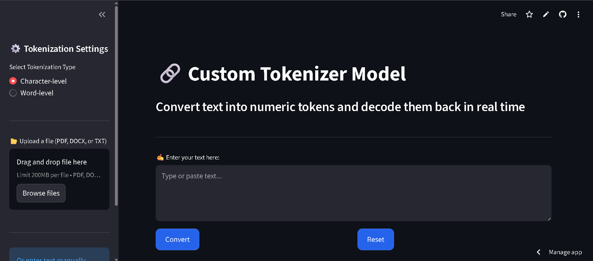

# Tokenizer — Streamlit App

A small Streamlit application that converts text into numeric tokens (character-level or word-level) and decodes them back in real time.

This repository contains a single-file Streamlit app and minimal configuration to run locally or deploy on Streamlit Cloud.

## Files

- `tokenizer.py` — Streamlit application.
- `requirements.txt` — Python dependencies.
- `streamlit.toml` — Streamlit Cloud configuration.
- `LICENSE` — License and usage terms.

## Quick local setup (Windows PowerShell)

1. Create and activate a virtual environment, then install dependencies:

```powershell
python -m venv .venv
.\.venv\Scripts\Activate.ps1
pip install -r requirements.txt
```

2. Run the app locally:

```powershell
streamlit run tokenizer.py
```

## Usage

- Use the sidebar to select tokenization level (Character-level or Word-level).
- Upload a PDF, DOCX, or TXT file or paste/type text into the main text area.
- Click **Convert** to build the vocabulary, see encoded tokens, and view the decoded output.

## Deploy to Streamlit Cloud

Link: https://tokenizer-converter.streamlit.app/

Screenshot :




## License & Permissions

This project currently uses a restrictive "All rights reserved" license. See the `LICENSE` file for details.

Permission to use, reproduce, modify, or distribute this software must be obtained from the copyright holder.
To request permission, contact: https://github.com/Shrikant-Pawar-45

## Contributing / Contact

- If you'd like to propose changes or request permission to use this code, please open an issue or contact the repository owner on GitHub.

